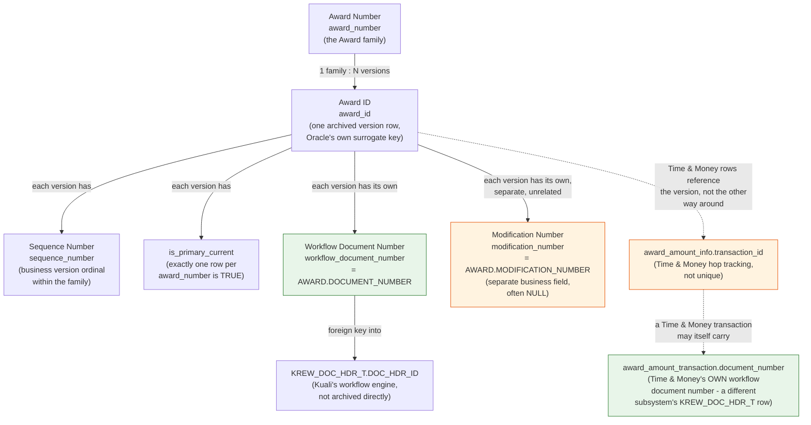

# Award Identifier Model

## Status

**Implemented and verified in dev.** Written after the Award workflow
document number rollout (`V055__add_award_workflow_document_number.sql`)
closed a real, user-reported gap: `documentNumber` had been wired to
`modification_number` — a different, often-NULL field with no
relationship to Kuali's workflow engine. That bug, and this document,
both exist because this archive accumulated six identifier-shaped
concepts on Award without ever writing down, in one place, what each
one actually identifies and how they relate. See `docs/DECISIONS.md`
for the correction's history and `AWARD_TIME_AND_MONEY_DESIGN.md` for
the other place in this codebase two identically-named columns
(`TRANSACTION_ID`) turned out to mean two different things — the same
class of mistake, caught the same way: reading the real Oracle schema
instead of assuming a name's meaning.

## Purpose

One reference for every identifier that appears on an archived Award
version, so a future change never again assumes two different Oracle
columns mean the same thing because they're both loosely "a document
number" or "an ID."

## The six identifiers

### 1. Award Number (`award_number`)

The Award **family** identifier (e.g. `"100567-00001"`) — stable across
every amendment/renewal of the same underlying Award. Business grain
for counting Awards is `COUNT(DISTINCT award_number)` (see CLAUDE.md's
"Research object model and business grain"). Never unique per row in
`archive.award_version` — every sequence of the same family shares it.

### 2. Award ID (`award_id`)

The surrogate primary key of one specific **version** row in
`archive.award_version` — Oracle's own real `AWARD.AWARD_ID`, not a
value invented by this archive. Unique per row. This is the identifier
exposed in every `/api/v1/awards/{awardId}/...` route, because a
specific version — not just the family — must be individually
addressable.

### 3. Sequence Number (`sequence_number`)

The **business version ordinal** within an `award_number` family (1, 2,
3, ...). Combined with `award_number`, identifies "the Nth version of
this Award family" in terms a Kuali user already thinks in. Multiple
rows may legitimately share the same `award_number` **and**
`sequence_number` when `award_id` differs (see CLAUDE.md) — sequence
number is a business version marker, not a uniqueness guarantee on its
own.

`is_primary_current` (exposed as `primaryCurrent`) marks exactly one
row per `award_number` family as the version currently in effect —
distinct from `sequence_number` itself, since the highest sequence
number is not always the one flagged current (e.g. mid-workflow or
superseded states can leave a lower sequence flagged current).

### 4. Workflow Document Number (`workflow_document_number`, API: `documentNumber`)

The real Kuali **workflow** document identifier: `AWARD.DOCUMENT_NUMBER`
in Oracle, the foreign key into `KREW_DOC_HDR_T.DOC_HDR_ID` (both
`VARCHAR2(40)` on BU's real schema — a same-type text join, never a
numeric cast). This is the number a BU research administrator actually
recognizes and searches by in Kuali — the workflow engine's identity
for the document that carried this Award version through approval, not
a business field on Award itself. Confirmed globally unique across the
entire archive (26,930 of 26,930 `archive.award_version` rows populated
and distinct as of the dev backfill in this rollout — see the rollout
report). Never synthesized: a row with no matching Oracle
`DOCUMENT_NUMBER` stays `NULL`, it is never backfilled with a
substitute value.

### 5. Modification Number (`modification_number`, API: `modificationNumber`)

A **separate**, Award-specific business field
(`AWARD.MODIFICATION_NUMBER`) with no relationship to
`KREW_DOC_HDR_T` or Kuali's workflow engine. Frequently `NULL` in real
BU data (confirmed for every sequence of the rollout's fixture Award,
100567-00001, and for every other award family spot-checked). This was
the field previously — incorrectly — treated as "the document number"
before this rollout; the two must never be conflated again, which is
why the API keeps them as two distinct, separately-named fields rather
than reusing one ambiguous name for both.

### 6. Transaction ID

Not one thing — this name collides across two different tables in this
same schema, exactly like `workflow_document_number` and
`modification_number` used to collide in meaning:

- `archive.award_amount_info.transaction_id` — a numeric surrogate key
  tracing back to a specific `PENDING_TRANSACTIONS`/
  `TRANSACTION_DETAILS` row in Oracle's Time and Money subsystem.
  Deliberately **not unique** — one Time-and-Money transaction can
  produce multiple `award_amount_info` rows (one per hierarchy hop, and
  potentially once each for a pending and an active Award version).
- `archive.award_amount_transaction`'s own Oracle-side `TRANSACTION_ID`
  column — despite the identical name, this is a **different concept**:
  a Time and Money **document number** (the same workflow-document
  shape as identifier #4, but for the Time and Money subsystem's own
  workflow document, not Award's). Archived under its own distinct
  column name, `award_amount_transaction.document_number`, specifically
  so it is never confused with `award_amount_info.transaction_id` — see
  `V048__add_time_and_money_columns_to_award_amount_info.sql` and
  `AWARD_TIME_AND_MONEY_DESIGN.md`.

## How the six relate

Green nodes are real Kuali **workflow document** identifiers (KEW/Rice,
`KREW_DOC_HDR_T`-shaped). Orange nodes are Award/Time-and-Money
**business** fields that are not workflow identifiers, despite sharing
similar-sounding names with the green ones — the exact distinction this
document exists to keep permanent.

## Where each one is exposed today

| Identifier | DB column | API field | Endpoint(s) |
|---|---|---|---|
| Award Number | `award_number` | `awardNumber` | search, hierarchy, summary, versions |
| Award ID | `award_id` | `awardId` | `/{awardId}/...` path segment throughout |
| Sequence Number | `sequence_number` | `sequenceNumber` | summary, versions, search exact-match |
| Current flag | `is_primary_current` | `primaryCurrent` | versions (added in this rollout) |
| Workflow Document Number | `workflow_document_number` | `documentNumber` (versions), `workflowDocumentNumber` (search exact-match) | versions, search |
| Modification Number | `modification_number` | `modificationNumber` | versions |
| Time & Money transaction id / document number | `award_amount_info.transaction_id` / `award_amount_transaction.document_number` | not yet exposed on any DTO | n/a |

## Planned follow-up (not yet done)

A later pass is expected to rename the API's `documentNumber` to
`workflowDocumentNumber` throughout (DB column name stays as-is;
Java/TypeScript naming becomes explicit) ahead of Budget, Time & Money,
Proposal, Subaward, and Negotiation each getting their own workflow
document number surfaced — all five confirmed (via real Oracle bootstrap
DDL) to have their own `DOCUMENT_NUMBER` column following the identical
`KREW_DOC_HDR_T` pattern Award does. The UI-facing label stays "Document
Number" regardless of the internal rename.
